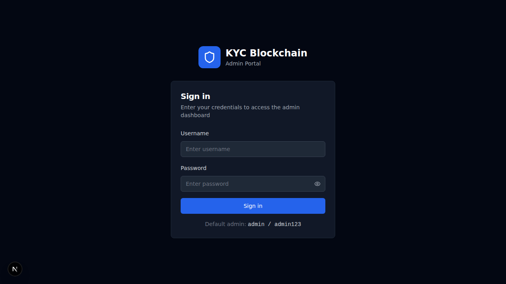
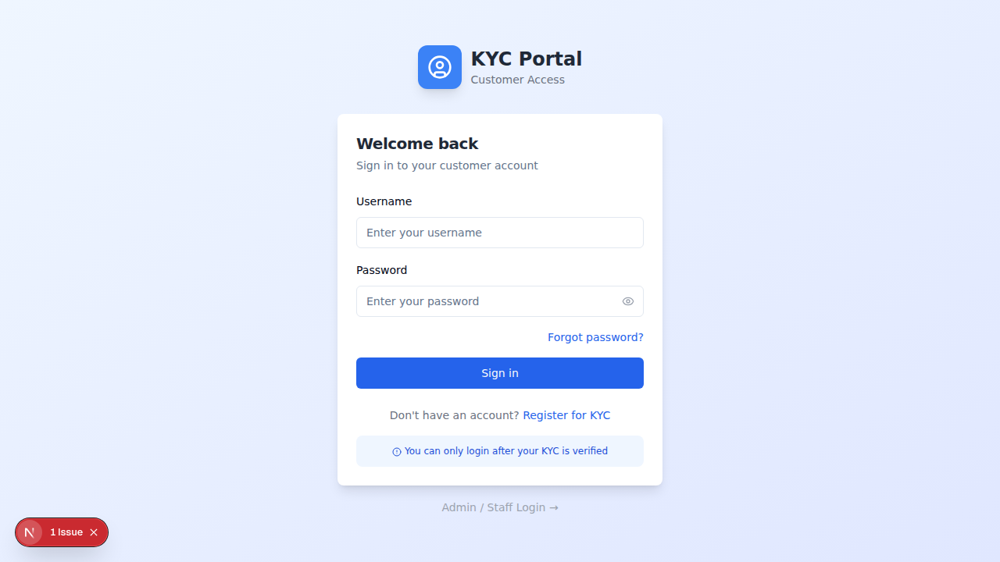

# I. Project File Structure

Next.js 15 Web UI for the KYC Blockchain system.

```bash
NextJS-Blockchain-KYC/
├── package.json
├── tsconfig.json
├── tailwind.config.ts
├── next.config.ts
├── .env.example
├── .gitignore
├── middleware.ts
├── app/
│   ├── layout.tsx
│   ├── page.tsx
│   ├── globals.css
│   ├── (auth)/
│   │   ├── layout.tsx
│   │   ├── login/
│   │   │   ├── admin/page.tsx
│   │   │   └── customer/page.tsx
│   │   ├── register/page.tsx
│   │   ├── forgot-password/page.tsx
│   │   └── change-password/page.tsx
│   ├── (admin)/
│   │   ├── layout.tsx
│   │   ├── dashboard/page.tsx
│   │   ├── kyc/
│   │   │   ├── page.tsx
│   │   │   ├── [id]/page.tsx
│   │   │   └── review/page.tsx
│   │   ├── blockchain/
│   │   │   ├── page.tsx
│   │   │   ├── blocks/page.tsx
│   │   │   └── pending/page.tsx
│   │   ├── banks/
│   │   │   ├── page.tsx
│   │   │   └── [id]/page.tsx
│   │   ├── certificates/
│   │   │   ├── page.tsx
│   │   │   └── verify/page.tsx
│   │   ├── audit/page.tsx
│   │   ├── security/page.tsx
│   │   ├── keys/page.tsx
│   │   ├── alerts/page.tsx
│   │   └── settings/
│   │       ├── page.tsx
│   │       ├── users/page.tsx
│   │       └── change-password/page.tsx
│   └── (customer)/
│       ├── layout.tsx
│       ├── dashboard/page.tsx
│       ├── kyc/
│       │   ├── page.tsx
│       │   └── register/page.tsx
│       └── certificate/page.tsx
├── components/
│   ├── layout/
│   │   ├── HamburgerSidebar.tsx
│   │   ├── TopBar.tsx
│   │   └── PortalBadge.tsx
│   ├── auth/
│   │   ├── AdminLoginForm.tsx
│   │   ├── CustomerLoginForm.tsx
│   │   ├── RegisterForm.tsx
│   │   ├── ChangePasswordForm.tsx
│   │   └── ForgotPasswordForm.tsx
│   ├── kyc/
│   │   ├── KYCTable.tsx
│   │   ├── KYCDetailCard.tsx
│   │   ├── KYCStatusBadge.tsx
│   │   └── KYCRegisterForm.tsx
│   ├── users/
│   │   ├── UserTable.tsx
│   │   └── CreateUserForm.tsx
│   ├── blockchain/
│   │   ├── BlocksTable.tsx
│   │   ├── BlockDetail.tsx
│   │   └── StatsCards.tsx
│   └── shared/
│       ├── StatusBadge.tsx
│       ├── ConfirmDialog.tsx
│       └── LoadingSpinner.tsx
├── lib/
│   ├── api.ts
│   ├── auth.ts
│   └── validations/
│       ├── password.ts
│       └── kyc.ts
├── stores/
│   └── auth.store.ts
└── types/
    ├── auth.ts
    ├── kyc.ts
    ├── bank.ts
    ├── blockchain.ts
    └── api.ts
```

## Setup

1. Clone this repository
2. Install dependencies: `npm install`
3. Copy environment variables: `cp .env.example .env.local` and fill in values
4. Run development server: `npm run dev`
5. Default admin login: username=`admin`, password=`admin123`
6. On first login, you will be forced to change your password

## Tech Stack

- Next.js 15 (App Router) + TypeScript
- Tailwind CSS + shadcn/ui
- NextAuth.js v5 (JWT)
- React Hook Form + Zod (validation)
- Zustand (client state)
- Axios (API client)
- lucide-react (icons)

## Portals

- Admin/Internal Users: `/login/admin`
- Customers: `/login/customer`

## Roles

- `RoleAdmin`       => `admin`          — Full access
- `RoleBankAdmin`   => `bank_admin`     — Bank-level admin
- `RoleBankOfficer` => `bank_officer`   — KYC review
- `RoleAuditor`     => `auditor`        — Read-only audit access
- `RoleCustomer`    => `customer`       — Customer portal only

## 

---

# II. Portal UI

**Admin Portal** — dark professional theme at /login/admin:



**Customer Portal** — clean friendly theme at /login/customer:



## Detail

Two completely different login UIs under one Next.js app:

### Portal 1: Admin & Internal Users (/login/admin)
- Dark professional theme
- Roles: admin, bank_admin, bank_officer, auditor
- After first login OR password expired → force redirect to /change-password
- Initial admin password: admin123
- Password requirements: minimum 15 characters, at least 1 capital letter, 1 number, 1 special character

### Portal 2: Customer (/login/customer)
- Clean friendly theme
- Routes: Login, Register, Forgot Password
- Customers cannot login until their KYC status = VERIFIED

---

# III. Go backend Endpoint

```bash 
# Auth
POST    /api/v1/auth/register
POST    /api/v1/auth/login
POST    /api/v1/auth/refresh
GET     /api/v1/auth/profile

# KYC
POST    /api/v1/kyc
GET     /api/v1/kyc
PUT     /api/v1/kyc
DELETE  /api/v1/kyc
GET     /api/v1/kyc/list
GET     /api/v1/kyc/history
POST    /api/v1/kyc/verify
POST    /api/v1/kyc/reject
POST    /api/v1/kyc/auto-verify
POST    /api/v1/kyc/review
GET     /api/v1/kyc/review/status
POST    /api/v1/kyc/upload-doc
POST    /api/v1/kyc/upload-doc/file
POST    /api/v1/kyc/upload-selfie
POST    /api/v1/kyc/scan-verify

# Banks
POST    /api/v1/banks
GET     /api/v1/banks
GET     /api/v1/banks/list

# Blockchain
GET     /api/v1/blockchain/stats
GET     /api/v1/blockchain/blocks
GET     /api/v1/blockchain/block
POST    /api/v1/blockchain/mine
GET     /api/v1/blockchain/pending
GET     /api/v1/blockchain/validate

# Audit & Security
GET     /api/v1/audit/logs
GET     /api/v1/security/alerts
POST    /api/v1/security/alerts/review

# Keys
POST    /api/v1/keys/generate
GET     /api/v1/keys
GET     /api/v1/keys/info
POST    /api/v1/keys/revoke

# Certificates
POST    /api/v1/certificate/issue
POST    /api/v1/certificate/verify
```

